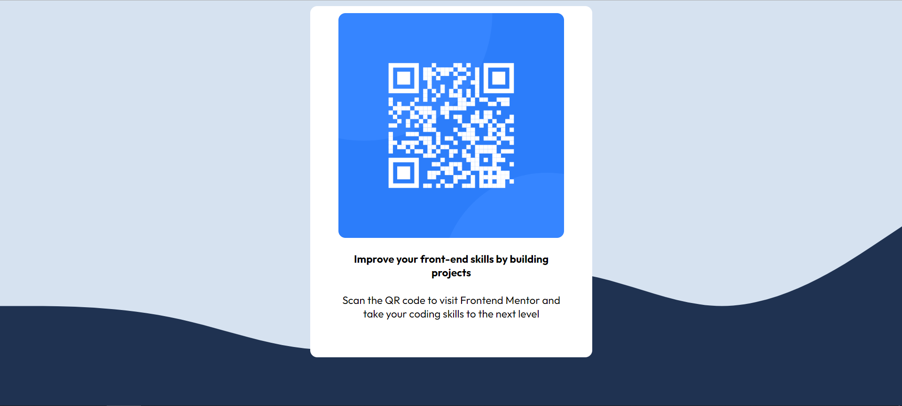

# Frontend Mentor - QR code component solution

This is a solution to the [QR code component challenge on Frontend Mentor](https://www.frontendmentor.io/challenges/qr-code-component-iux_sIO_H). Frontend Mentor challenges help you improve your coding skills by building realistic projects. 

## Table of contents

- [Overview](#overview)
  - [Screenshot](#screenshot)
  - [Links](#links)
- [My process](#my-process)
  - [Built with](#built-with)
  - [What I learned](#what-i-learned)
  - [Continued development](#continued-development)
  - [Useful resources](#useful-resources)
- [Author](#author)

## Overview

### Screenshot

### Links

- GitHub Repo : (https://github.com/LabrousseDev/QR-Code)
- Live Site : (https://qr-code-blush.vercel.app/)

## My process

### Built with

- Basic HTML5 syntax
- Flexbox CSS
- Wave Generator Site (https://getwaves.io/)
- Vercel to launch the site

### What I learned

I learned how to use Flexbox and sizing an image and text to make thme fit in a div.
I also learned how to include a background image and how to position it nicely.
I did my first production site launching with Vercel and this was a very good moment beacuse I found it very intuitive and easy.

### Continued development
I still feel the need to do some more projects where I can implement Flexbox and train my CSS techniques. I am not completly confident in them right now.

### Useful resources

- MDN for CSS properties and values

## Author

- Frontend Mentor - [@LabrousseDev](https://www.frontendmentor.io/profile/LabrousseDev)

